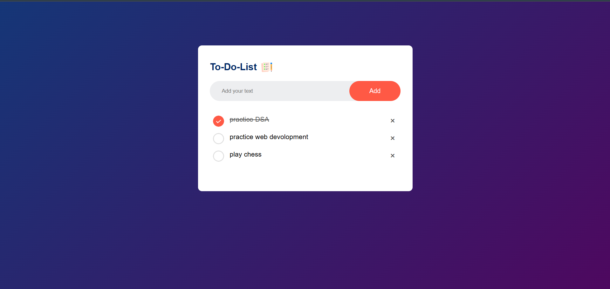

# 📝 To-Do List App

A simple and responsive to-do list web application built using HTML, CSS, and JavaScript.

---

## 🚀 Live Demo

👉 [Click Here to Try It](https://rakshithdn.github.io/To-Do-List/)  
Or visit: `https://rakshithdn.github.io/To-Do-List/`

---

## 📸 Screenshot

---

## 🧩 Features

- ➕ Add tasks
- ✅ Mark tasks as done
- ❌ Delete tasks
- 📱 Responsive design (mobile-friendly)
- 💾 Planned support for `localStorage`

---

## 🔧 Tech Stack

- 
- 
- 

---

## 🛠️ How It Works

1. User types a task in the input field
2. Clicks the “Add” button to create a new task
3. Tasks appear in a dynamic list
4. Buttons for checking or deleting tasks

---

## 🙋‍♂️ Author

Made with ❤️ by [Rakshith D N](https://github.com/RakshithDN/)

---

## 📌 Future Enhancements

- 🌙 Dark mode toggle
- 🔃 Task reordering (drag & drop)
- 📆 Task due dates
